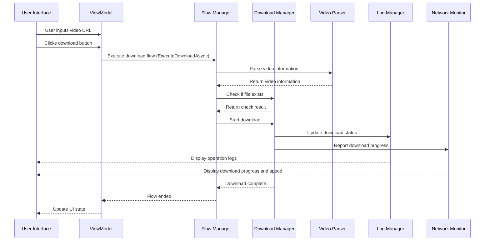

# Video Stream Researcher Architecture Design Document

## 1. Architecture Overview

The Video Stream Researcher adopts a modern MVVM (Model-View-ViewModel) architecture pattern, combining dependency injection and interface segregation principles to achieve clear code organization and good maintainability. The project is based on .NET 8.0 and the Avalonia UI framework, supporting cross-platform execution.

### 1.1 Architecture Layers

The project architecture is divided into the following layers:

| Layer | Responsibility | File Location | Core Components |
|-------|---------------|---------------|-----------------|
| **Presentation Layer (UI)** | User interface display and interaction | UI/ | MainWindow.axaml |
| **ViewModel Layer** | Business logic and data binding | ViewModels/ | MainWindowViewModel.cs |
| **Application Flow Layer** | Business process orchestration | Services/ | DownloadFlowManager.cs |
| **Service Layer** | Core functionality implementation | Services/ | DownloadManager.cs, VideoParserWrapper.cs |
| **Interface Layer** | Service interface definitions | Interfaces/ | IServices.cs |
| **Model Layer** | Data model definitions | Models/ | AppModels.cs |
| **Logging Layer** | Log management and display | Logs/ | LogManager.cs, NetworkSpeedMonitor.cs |
| **Infrastructure Layer** | Dependency injection and infrastructure | Infrastructure/ | DependencyInjectionConfig.cs |

### 1.2 Core Flow Diagram



## 2. Core Component Design

### 2.1 Dependency Injection Container

The dependency injection container is responsible for managing the lifecycle and dependencies of all services, serving as the core infrastructure of the entire application.

**Implementation File**: `Infrastructure/DependencyInjectionConfig.cs`

**Core Functions**:
- Register all service interfaces and implementations
- Configure service lifecycles
- Provide service instance retrieval methods

**Service Registration**:
| Service Interface | Implementation Class | Lifecycle |
|------------------|---------------------|-----------|
| IConfigManager | ConfigManager | Singleton |
| IDownloadFlowManager | DownloadFlowManager | Transient |
| IDownloadManager | DownloadManager | Transient |
| ILogManager | LogManager | Transient |
| INetworkSpeedMonitor | NetworkSpeedMonitor | Transient |
| IVideoParser | VideoParserWrapper | Transient |
| MainWindowViewModel | MainWindowViewModel | Transient |

### 2.2 Download Manager

The download manager is one of the core services of the project, responsible for handling the complete video download process.

**Implementation File**: `Services/DownloadManager.cs`

**Core Functions**:
- Parse video stream information
- Handle different download modes (full video, audio only, video only)
- Implement resume capability
- Merge audio and video streams
- Handle network errors and exceptions

**Download Flow**:
1. Check if file already exists
2. Initialize download parameters
3. Download video and audio streams
4. Merge audio and video streams (if needed)
5. Clean up temporary files
6. Report download results

### 2.3 Video Parser

The video parser is responsible for extracting video information and stream addresses from video URLs.

**Implementation File**: `Services/VideoParserWrapper.cs`

**Core Functions**:
- Wrap VideoStreamFetcher.Parsers.VideoParser
- Implement IVideoParser interface
- Handle parsing errors and exceptions

### 2.4 Log Manager

The log manager is responsible for handling and displaying operation logs, supporting collapsible log structures.

**Implementation File**: `Logs/LogManager.cs`

**Core Functions**:
- Update regular logs
- Update collapsible logs
- Manage log entry count
- Support log collapse/expand

### 2.5 Network Speed Monitor

The network speed monitor is responsible for real-time monitoring and display of download speed and progress.

**Implementation File**: `Logs/NetworkSpeedMonitor.cs`

**Core Functions**:
- Display real-time download speed
- Calculate and display estimated remaining time
- Draw network speed change charts
- Provide progress animation effects

### 2.6 ViewModel

The ViewModel is the bridge connecting the UI and services, implementing business logic and data binding.

**Implementation File**: `ViewModels/MainWindowViewModel.cs`

**Core Functions**:
- Manage UI state and properties
- Implement command handling logic
- Coordinate service calls
- Handle user input

**Main Commands**:
- BrowseCommand: Browse folders
- DownloadCommand: Start download
- CancelCommand: Cancel download
- ThemeToggleCommand: Toggle theme
- EnterOptionModeCommand: Enter option mode

## 3. Data Model Design

### 3.1 Core Data Models

| Model Class | Description | Fields |
|-------------|-------------|--------|
| **AppConfig** | Application configuration | SavePath, IsDarkTheme, IsFFmpegEnabled, MergeMode |
| **VideoInfo** | Video information | Title, VideoStream, AudioStream, CombinedStreams |
| **VideoStreamInfo** | Video stream information | Url, Size, Quality |
| **LogEntry** | Log entry | Message, Timestamp, Level |

### 3.2 Configuration Management

Application configuration uses JSON format storage, managed through the `ConfigManager` service. The configuration file is located at `config.json` in the application runtime directory.

**Configuration Options**:
- **SavePath**: Default save path
- **IsDarkTheme**: Whether to use dark theme
- **IsFFmpegEnabled**: Whether to enable FFmpeg (reserved option)
- **MergeMode**: MP4 merge mode

## 4. UI Design and Implementation

### 4.1 Main Window Layout

The main window uses Grid layout, divided into the following areas:

1. **Video URL Input Area**: Contains text box and theme toggle button
2. **Save Path Area**: Contains text box and browse button
3. **Download Options Area**: Contains radio button group and start download button
4. **Status and Log Area**: Contains speed display, status text, and collapsible logs

### 4.2 Data Binding

UI elements are bound to ViewModel properties through Avalonia's data binding mechanism:

- **Video URL**: `Text="{Binding Url, Mode=TwoWay}"`
- **Save Path**: `Text="{Binding SavePath, Mode=TwoWay}"`
- **Download Options**: `IsChecked="{Binding IsAudioOnly, Mode=TwoWay}"`
- **Command Binding**: `Command="{Binding DownloadCommand}"`

### 4.3 Collapsible Logs

Collapsible logs are implemented using a custom `CollapsibleLogItem` control, supporting:

- Creation and management of root log entries
- Addition of child log entries
- Automatic collapse/expand of logs
- Visual distinction of different log types

## 5. Error Handling and Exception Management

### 5.1 Exception Handling Strategy

The project adopts a multi-level exception handling strategy:

1. **Service Layer Exceptions**: Capture and handle specific exceptions in service methods, converting to user-friendly error messages
2. **ViewModel Layer Exceptions**: Capture unhandled exceptions from the service layer, update UI state and logs
3. **UI Layer Exceptions**: Handle UI-related exceptions to ensure the application does not crash

### 5.2 Error Message Handling

Error messages are displayed to users through the logging system, divided into the following types:

- **Parse Errors**: Displayed when video parsing fails
- **Download Errors**: Displayed when errors occur during download
- **Network Errors**: Displayed when network connection issues occur
- **File Errors**: Displayed when file operations fail

## 6. Performance Optimization Strategies

### 6.1 Memory Management

- **Resource Release**: Use `using` statements to ensure timely resource release
- **Object Reuse**: Reuse UI controls and data structures to reduce memory allocation
- **Garbage Collection**: Trigger garbage collection at appropriate times, especially after processing large files

### 6.2 Network Optimization

- **Resume Capability**: Support HTTP Range requests for resume capability
- **Connection Management**: Optimize HTTP connection management to reduce connection establishment overhead
- **Timeout Settings**: Set reasonable network timeouts to avoid infinite waiting

### 6.3 UI Responsiveness

- **Asynchronous Operations**: Use `async/await` pattern for time-consuming operations
- **Dispatcher**: Use `Dispatcher.UIThread` to ensure UI updates execute on the main thread
- **Progress Updates**: Optimize progress update frequency to avoid overloading the UI thread

## 7. Extension and Maintenance

### 7.1 Supporting New Video Platforms

To add support for new video platforms, you need to:

1. Implement a new implementation of the `IVideoParser` interface
2. Register the new parser in `DependencyInjectionConfig.cs`
3. Update the video information model to support the new platform's features

### 7.2 Adding New Features

Recommended process for adding new features:

1. Define new service interfaces in `Interfaces/IServices.cs`
2. Implement services in the `Services/` directory
3. Register services in `DependencyInjectionConfig.cs`
4. Add corresponding properties and commands in `ViewModels/MainWindowViewModel.cs`
5. Add corresponding UI elements in `UI/MainWindow.axaml`

### 7.3 Code Maintenance Guidelines

- **Naming Conventions**: Follow C# naming conventions, use PascalCase for classes and methods
- **Code Style**: Use consistent code style, including indentation, spaces, and comments
- **Documentation**: Add XML documentation comments for public methods and classes
- **Testing**: Add unit tests for core functionality
- **Logging**: Add logs at key operations for debugging and troubleshooting

## 8. Technology Stack and Dependencies

| Technology/Dependency | Version | Purpose | Source |
|----------------------|---------|---------|--------|
| **.NET** | 8.0 | Runtime framework | Microsoft |
| **Avalonia** | 11.0+ | Cross-platform UI framework | AvaloniaUI |
| **ReactiveUI** | 18.0+ | Reactive UI framework | ReactiveUI |
| **Microsoft.Extensions.DependencyInjection** | 8.0+ | Dependency injection container | Microsoft |
| **Mp4Merger** | Custom | MP4 audio/video merge | Project reference |
| **VideoStreamFetcher** | Custom | Video stream parsing | Project reference |
| **Fody** | 6.0+ | IL weaving tool | NuGet |
| **HtmlAgilityPack** | 1.11+ | HTML parsing | NuGet |
| **Newtonsoft.Json** | 13.0+ | JSON serialization | NuGet |

## 9. Deployment and Release

### 9.1 Build Configurations

The project supports the following build configurations:

- **Debug**: Debug configuration, includes debug symbols and detailed logs
- **Release**: Release configuration, optimized for performance and size

### 9.2 Release Options

| Release Option | Command | Description |
|----------------|---------|-------------|
| **Framework-dependent** | `dotnet publish -c Release` | Depends on .NET runtime installed on target machine |
| **Self-contained** | `dotnet publish -c Release -r win-x64 --self-contained true` | Includes all dependencies, no .NET runtime required |
| **Single-file** | `dotnet publish -c Release -r win-x64 --self-contained true /p:PublishSingleFile=true` | Packaged as a single executable file |
| **Trimmed** | `dotnet publish -c Release -r win-x64 --self-contained true /p:PublishTrimmed=true` | Trim unused code to reduce size |

### 9.3 Cross-Platform Support

The project is based on the Avalonia UI framework and theoretically supports the following platforms:

- **Windows**: Fully supported
- **macOS**: Basic functionality supported
- **Linux**: Basic functionality supported
- **Android**: Partially supported, requires UI layout adjustments

## 10. Monitoring and Logging

### 10.1 Logging System

The project uses a custom logging system, supporting the following features:

- **Level-based Logs**: Different log types use different icons for identification
- **Collapsible Logs**: Support log collapse and expand
- **Real-time Updates**: Logs display in real-time without refresh
- **Automatic Cleanup**: Limit log entry count to avoid excessive memory usage

### 10.2 Network Monitoring

The network monitoring system provides the following features:

- **Real-time Speed**: Display current download speed
- **Progress Animation**: Smooth progress bar animation
- **Remaining Time**: Estimate remaining download time based on historical speed
- **Speed Chart**: Display network speed change trends

## 11. Security Considerations

### 11.1 Security Measures

- **Network Request Security**: Use HTTPS protocol, add appropriate request headers
- **File Operation Security**: Validate file paths to avoid path traversal attacks
- **Exception Handling**: Avoid leaking sensitive information in exception messages
- **Configuration Management**: Do not store sensitive information in configuration files

### 11.2 Compliance

- **Copyright Notice**: Clearly state the tool's purpose and limitations
- **Disclaimer**: State that the tool is for technical research and learning only
- **Usage Restrictions**: Restrict commercial use of the tool

## 12. Conclusion and Future Outlook

### 12.1 Architecture Advantages

- **Modular Design**: Clear separation of responsibilities, easy to maintain and extend
- **Dependency Injection**: Loosely coupled component design, improving code testability
- **Reactive UI**: Use ReactiveUI for smooth user experience
- **Cross-platform Support**: Based on Avalonia framework, supports multi-platform execution
- **Performance Optimization**: Various performance optimization strategies to ensure smooth user experience

### 12.2 Future Improvement Directions

1. **Multi-platform Support**: Further improve support for macOS and Linux
2. **Mobile Platform Adaptation**: Adapt for Android and iOS platforms
3. **Plugin System**: Implement plugin system to support extended video platforms
4. **Batch Download**: Support batch video downloads
5. **Video Transcoding**: Integrate video transcoding functionality
6. **Cloud Storage Integration**: Support uploading downloaded videos to cloud storage
7. **Multi-language Support**: Add multi-language interface
8. **Unit Testing**: Improve unit test coverage
9. **CI/CD**: Build continuous integration and continuous deployment pipeline
10. **Documentation**: Further improve project documentation

### 12.3 Technical Innovation Points

- **Collapsible Log System**: Provide clear operation records and debugging information
- **Intelligent Network Monitoring**: Real-time analysis of network speed and estimated download time
- **Modular Architecture**: Code structure that is easy to extend and maintain
- **Cross-platform Compatibility**: Cross-platform support based on Avalonia
- **Responsive Design**: Smooth user experience using ReactiveUI

## 13. Code Quality and Architecture Assessment

### 13.1 Code Review Results (2026-04-18)

Based on a comprehensive code review by the MP4 Merger Architect Agent, here are the assessment results:

#### Overall Ratings

| Assessment Dimension | Score | Status |
|---------------------|-------|--------|
| **Architecture Design** | 85/100 | ✅ Good |
| **SOLID Principles** | 80/100 | ✅ Good |
| **Coding Standards** | 85/100 | ✅ Compliant |
| **Code Readability** | 88/100 | ✅ Excellent |
| **Maintainability** | 82/100 | ✅ Good |
| **Performance** | 80/100 | ✅ Good |
| **Security** | 75/100 | ⚠️ Needs Improvement |

#### SOLID Principles Compliance

| Principle | Status | Description |
|-----------|--------|-------------|
| **Single Responsibility (SRP)** | ✅ Compliant | MP4Merger/MediaProcessor have clear responsibilities, VideoDownloader needs refactoring |
| **Open/Closed (OCP)** | ✅ Compliant | Factory and Strategy patterns properly applied, easy to extend with new platform parsers |
| **Liskov Substitution (LSP)** | ✅ Compliant | BoxBase abstract base class well designed |
| **Interface Segregation (ISP)** | ✅ Compliant | IPlatformParser interface is lean and focused |
| **Dependency Inversion (DIP)** | ✅ Compliant | High-level modules depend on abstract interfaces |

#### Design Pattern Applications

1. **Factory Pattern** - VideoParserFactory
   - Automatically dispatches to appropriate parser based on URL
   - Supports dynamic extension for new platforms

2. **Strategy Pattern** - IPlatformParser
   - Unified interface defines platform parsing behavior
   - BilibiliParser, MiyousheParser, KuaishouParserLite implementations

3. **Dependency Injection** - VideoStreamClient
   - Supports constructor injection
   - Improves testability

#### Key Improvement Recommendations

**High Priority:**
1. **Refactor VideoDownloader Class** (550+ lines)
   - Split into StreamPathResolver, RemuxService, DownloadStrategyFactory
   - Reduce single class responsibilities

2. **Strengthen Input Validation**
   - Add file path security validation
   - Prevent path traversal attacks

**Medium Priority:**
3. **Unify Exception Handling Strategy**
   - Define domain-specific exceptions
   - Preserve exception stack traces

4. **Extract Hardcoded Configurations**
   - User-Agent, timeout values, etc.
   - Use configuration classes for management

**Low Priority:**
5. Enable nullable reference types
6. Improve async method naming conventions

### 13.2 Project Structure Optimization

```
src/
├── Mp4Merger.Core/          # MP4 merge core library
│   ├── Boxes/               # MP4 box definitions (BoxBase, FtypBox, MdatBox, MoovBox)
│   ├── Builders/            # Track builders (AudioTrackBuilder, VideoTrackBuilder)
│   ├── Core/                # Core processing classes
│   │   ├── MP4Merger.cs     # Merge coordinator
│   │   ├── MediaProcessor.cs # Media data processing
│   │   ├── MP4Writer.cs     # File writer
│   │   └── MP4Validator.cs  # Validator
│   ├── Media/               # Media extraction
│   ├── Models/              # Data models (MP4FileInfo, MergeResult)
│   ├── Services/            # Public services (Mp4MergeService)
│   └── Utils/               # Utility classes
├── VideoStreamFetcher/      # Video stream fetch library
│   ├── Auth/                # Authentication management (BilibiliLoginManager)
│   ├── Downloads/           # Download functionality
│   │   ├── VideoDownloader.cs    # Main downloader (needs refactoring)
│   │   ├── HlsDownloader.cs      # HLS downloader
│   │   ├── VideoDownloadOptions.cs # Download options
│   │   └── DownloadPathHelper.cs   # Path helper
│   ├── Parsers/             # Video parsing
│   │   ├── PlatformParsers/ # Platform-specific parsers
│   │   │   ├── IPlatformParser.cs      # Parser interface
│   │   │   ├── VideoParserFactory.cs   # Parser factory
│   │   │   ├── BilibiliParser.cs       # Bilibili parser
│   │   │   ├── MiyousheParser.cs       # Miyoushe parser
│   │   │   └── KuaishouParserLite.cs   # Kuaishou parser
│   │   ├── VideoParser.cs   # Main parser
│   │   ├── VideoInfo.cs     # Video information model
│   │   └── HttpHelper.cs    # HTTP request helper
│   └── Remux/               # Remux functionality (TsToMp4Remuxer)
├── VideoPreviewer/          # Video preview
└── NativeVideoProcessor/    # Native video processing
```

## Appendix A: Core API Reference

### A.1 IDownloadManager Interface

```csharp
public interface IDownloadManager : IDisposable
{
    Task<long> DownloadVideo(
        object videoInfo,
        string savePath,
        Action<double> progressCallback,
        Action<string> statusCallback,
        Action<long> speedCallback,
        bool audioOnly = false,
        bool videoOnly = false,
        bool noMerge = false,
        bool isFFmpegEnabled = false,
        int mergeMode = 1);
        
    bool CheckFileExists(
        object videoInfo,
        string savePath,
        Action<string> statusCallback,
        bool audioOnly = false,
        bool videoOnly = false);
        
    void CancelDownload();
}
```

### A.2 IVideoParser Interface

```csharp
public interface IVideoParser : IDisposable
{
    Task<object?> ParseVideoInfo(string url, Action<string> statusCallback);
}
```

### A.3 ILogManager Interface

```csharp
public interface ILogManager
{
    void UpdateLog(string message);
    void UpdateCollapsibleLog(string message, bool isRootItem = true, bool autoCollapse = true);
    void ResetCollapsibleLog();
}
```

### A.4 INetworkSpeedMonitor Interface

```csharp
public interface INetworkSpeedMonitor : IDisposable
{
    void UpdateProcessingProgress(double progress);
    void UpdateCurrentStatus(string status);
    void OnSpeedUpdate(long speed, bool isInitial = false);
    void MarkDownloadCompleted();
    void MarkDownloadCanceled();
    Task ResetProgressAnimation();
}
```

### A.5 IConfigManager Interface

```csharp
public interface IConfigManager
{
    T ReadConfig<T>(string key, T defaultValue = default);
    void SaveConfig<T>(string key, T value);
    void ResetConfig();
}
```

## Appendix B: Configuration File Reference

### B.1 config.json Example

```json
{
  "SavePath": "C:\\Users\\Username\\Desktop",
  "IsDarkTheme": true,
  "IsFFmpegEnabled": false,
  "MergeMode": 1
}
```

### B.2 Configuration Options Description

| Option | Type | Default | Description |
|--------|------|---------|-------------|
| **SavePath** | string | Desktop | Default save path |
| **IsDarkTheme** | bool | true | Whether to use dark theme |
| **IsFFmpegEnabled** | bool | false | Whether to enable FFmpeg (reserved) |
| **MergeMode** | int | 1 | MP4 merge mode (1=NonFragmented) |

## Appendix C: Common Issues and Solutions

| Issue | Possible Cause | Solution |
|-------|---------------|----------|
| **Video parsing failed** | URL format error or network issue | Check URL format, ensure network connection is normal |
| **Slow download speed** | Network restrictions or server throttling | Try different network, or try again later |
| **Merge failed** | Insufficient disk space or permission issues | Ensure sufficient disk space, check file permissions |
| **Application crash** | Unhandled exception | Check log files, contact developer |
| **Configuration save failed** | Permission issues | Ensure application has write permissions |
| **Theme toggle not working** | Configuration not saved | Restart application, check configuration file permissions |
