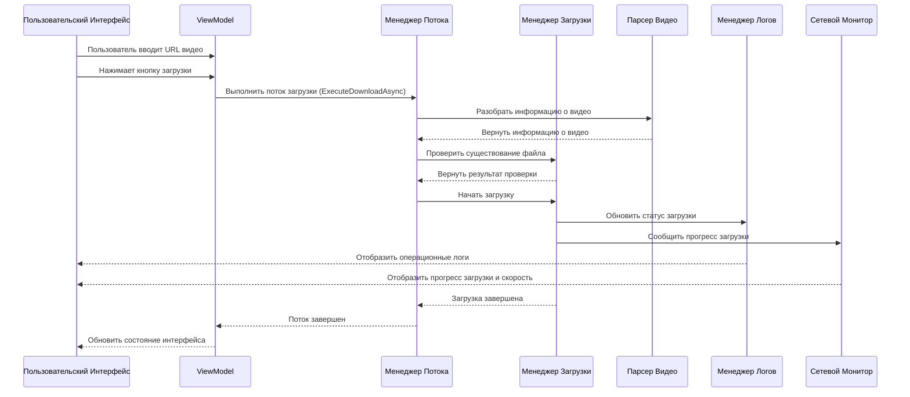

# Документ Архитектуры Исследователя Видеопотоков

## 1. Обзор Архитектуры

Исследователь видеопотоков использует современную архитектурную модель MVVM (Model-View-ViewModel), сочетающую внедрение зависимостей и принципы разделения интерфейсов для достижения четкой организации кода и хорошей поддерживаемости. Проект основан на .NET 8.0 и фреймворке Avalonia UI, поддерживая кроссплатформенное выполнение.

### 1.1 Архитектурные Уровни

Архитектура проекта разделена на следующие уровни:

| Уровень | Ответственность | Расположение Файлов | Основные Компоненты |
|---------|-----------------|---------------------|---------------------|
| **Уровень Представления (UI)** | Отображение пользовательского интерфейса и взаимодействие | UI/ | MainWindow.axaml |
| **Уровень ViewModel** | Бизнес-логика и привязка данных | ViewModels/ | MainWindowViewModel.cs |
| **Уровень Потока Приложения** | Оркестрация бизнес-процессов | Services/ | DownloadFlowManager.cs |
| **Сервисный Уровень** | Реализация основной функциональности | Services/ | DownloadManager.cs, VideoParserWrapper.cs |
| **Уровень Интерфейсов** | Определения интерфейсов сервисов | Interfaces/ | IServices.cs |
| **Уровень Моделей** | Определения моделей данных | Models/ | AppModels.cs |
| **Уровень Логирования** | Управление логами и отображение | Logs/ | LogManager.cs, NetworkSpeedMonitor.cs |
| **Инфраструктурный Уровень** | Инфраструктура внедрения зависимостей | Infrastructure/ | DependencyInjectionConfig.cs |

### 1.2 Диаграмма Основного Потока



## 2. Проектирование Основных Компонентов

### 2.1 Контейнер Внедрения Зависимостей

Контейнер внедрения зависимостей отвечает за управление жизненным циклом и зависимостями всех сервисов, являясь основной инфраструктурой всего приложения.

**Файл Реализации**: `Infrastructure/DependencyInjectionConfig.cs`

**Основные Функции**:
- Регистрация всех интерфейсов сервисов и реализаций
- Конфигурация жизненных циклов сервисов
- Предоставление методов получения экземпляров сервисов

**Регистрация Сервисов**:
| Интерфейс Сервиса | Класс Реализации | Жизненный Цикл |
|------------------|------------------|----------------|
| IConfigManager | ConfigManager | Одиночка |
| IDownloadFlowManager | DownloadFlowManager | Переходный |
| IDownloadManager | DownloadManager | Переходный |
| ILogManager | LogManager | Переходный |
| INetworkSpeedMonitor | NetworkSpeedMonitor | Переходный |
| IVideoParser | VideoParserWrapper | Переходный |
| MainWindowViewModel | MainWindowViewModel | Переходный |

### 2.2 Менеджер Загрузки

Менеджер загрузки является одним из основных сервисов проекта, отвечающим за обработку полного процесса загрузки видео.

**Файл Реализации**: `Services/DownloadManager.cs`

**Основные Функции**:
- Разбор информации о видеопотоке
- Обработка различных режимов загрузки (полное видео, только аудио, только видео)
- Реализация возможности возобновления
- Объединение аудио и видеопотоков
- Обработка сетевых ошибок и исключений

**Поток Загрузки**:
1. Проверить, существует ли файл
2. Инициализировать параметры загрузки
3. Загрузить видео и аудиопотоки
4. Объединить аудио и видеопотоки (при необходимости)
5. Очистить временные файлы
6. Сообщить результаты загрузки

### 2.3 Парсер Видео

Парсер видео отвечает за извлечение информации о видео и адресов потоков из URL видео.

**Файл Реализации**: `Services/VideoParserWrapper.cs`

**Основные Функции**:
- Обертка для VideoStreamFetcher.Parsers.VideoParser
- Реализация интерфейса IVideoParser
- Обработка ошибок разбора и исключений

### 2.4 Менеджер Логов

Менеджер логов отвечает за обработку и отображение операционных логов, поддерживая структуры сворачиваемых логов.

**Файл Реализации**: `Logs/LogManager.cs`

**Основные Функции**:
- Обновление обычных логов
- Обновление сворачиваемых логов
- Управление количеством записей логов
- Поддержка сворачивания/разворачивания логов

### 2.5 Монитор Скорости Сети

Монитор скорости сети отвечает за мониторинг и отображение скорости загрузки и прогресса в реальном времени.

**Файл Реализации**: `Logs/NetworkSpeedMonitor.cs`

**Основные Функции**:
- Отображение скорости загрузки в реальном времени
- Расчет и отображение оценочного оставшегося времени
- Отрисовка графиков изменения скорости сети
- Предоставление эффектов анимации прогресса

### 2.6 ViewModel

ViewModel является мостом, соединяющим UI и сервисы, реализуя бизнес-логику и привязку данных.

**Файл Реализации**: `ViewModels/MainWindowViewModel.cs`

**Основные Функции**:
- Управление состоянием UI и свойствами
- Реализация логики обработки команд
- Координация вызовов сервисов
- Обработка пользовательского ввода

**Основные Команды**:
- BrowseCommand: Просмотр папок
- DownloadCommand: Начать загрузку
- CancelCommand: Отменить загрузку
- ThemeToggleCommand: Переключить тему
- EnterOptionModeCommand: Войти в режим опций

## 3. Проектирование Моделей Данных

### 3.1 Основные Модели Данных

| Класс Модели | Описание | Поля |
|--------------|----------|------|
| **AppConfig** | Конфигурация приложения | SavePath, IsDarkTheme, IsFFmpegEnabled, MergeMode |
| **VideoInfo** | Информация о видео | Title, VideoStream, AudioStream, CombinedStreams |
| **VideoStreamInfo** | Информация о видеопотоке | Url, Size, Quality |
| **LogEntry** | Запись лога | Message, Timestamp, Level |

### 3.2 Управление Конфигурацией

Конфигурация приложения использует хранение в формате JSON, управляемое через сервис `ConfigManager`. Файл конфигурации расположен в `config.json` в директории выполнения приложения.

**Опции Конфигурации**:
- **SavePath**: Путь сохранения по умолчанию
- **IsDarkTheme**: Использовать ли темную тему
- **IsFFmpegEnabled**: Включить ли FFmpeg (зарезервированная опция)
- **MergeMode**: Режим объединения MP4

## 4. Проектирование и Реализация UI

### 4.1 Макет Главного Окна

Главное окно использует макет Grid, разделенный на следующие области:

1. **Область Ввода URL Видео**: Содержит текстовое поле и кнопку переключения темы
2. **Область Пути Сохранения**: Содержит текстовое поле и кнопку просмотра
3. **Область Опций Загрузки**: Содержит группу переключателей и кнопку начала загрузки
4. **Область Статуса и Логов**: Содержит отображение скорости, текст статуса и сворачиваемые логи

### 4.2 Привязка Данных

Элементы UI привязаны к свойствам ViewModel через механизм привязки данных Avalonia:

- **URL Видео**: `Text="{Binding Url, Mode=TwoWay}"`
- **Путь Сохранения**: `Text="{Binding SavePath, Mode=TwoWay}"`
- **Опции Загрузки**: `IsChecked="{Binding IsAudioOnly, Mode=TwoWay}"`
- **Привязка Команд**: `Command="{Binding DownloadCommand}"`

### 4.3 Сворачиваемые Логи

Сворачиваемые логи реализованы с использованием пользовательского элемента управления `CollapsibleLogItem`, поддерживающего:

- Создание и управление корневыми записями логов
- Добавление дочерних записей логов
- Автоматическое сворачивание/разворачивание логов
- Визуальное различение различных типов логов

## 5. Обработка Ошибок и Управление Исключениями

### 5.1 Стратегия Обработки Исключений

Проект использует многоуровневую стратегию обработки исключений:

1. **Исключения Сервисного Уровня**: Перехват и обработка конкретных исключений в методах сервисов, преобразование в понятные сообщения об ошибках
2. **Исключения Уровня ViewModel**: Перехват необработанных исключений от сервисного уровня, обновление состояния UI и логов
3. **Исключения Уровня UI**: Обработка исключений, связанных с UI, для обеспечения стабильности приложения

### 5.2 Обработка Сообщений Об Ошибках

Сообщения об ошибках отображаются пользователям через систему логирования, разделенные на следующие типы:

- **Ошибки Разбора**: Отображаются при сбое разбора видео
- **Ошибки Загрузки**: Отображаются при возникновении ошибок во время загрузки
- **Сетевые Ошибки**: Отображаются при проблемах с сетевым подключением
- **Ошибки Файлов**: Отображаются при сбоях файловых операций

## 6. Стратегии Оптимизации Производительности

### 6.1 Управление Памятью

- **Освобождение Ресурсов**: Использование операторов `using` для обеспечения своевременного освобождения ресурсов
- **Повторное Использование Объектов**: Повторное использование элементов управления UI и структур данных для уменьшения выделения памяти
- **Сборка Мусора**: Запуск сборки мусора в подходящие моменты, особенно после обработки больших файлов

### 6.2 Оптимизация Сети

- **Возобновление**: Поддержка HTTP Range запросов для возможности возобновления
- **Управление Подключениями**: Оптимизация управления HTTP-подключениями для уменьшения накладных расходов на установку соединений
- **Настройки Таймаута**: Установка разумных сетевых таймаутов для избежания бесконечного ожидания

### 6.3 Отзывчивость UI

- **Асинхронные Операции**: Использование паттерна `async/await` для длительных операций
- **Dispatcher**: Использование `Dispatcher.UIThread` для обеспечения выполнения обновлений UI в главном потоке
- **Обновления Прогресса**: Оптимизация частоты обновления прогресса для избежания перегрузки UI-потока

## 7. Расширение и Поддержка

### 7.1 Поддержка Новых Видеоплатформ

Для добавления поддержки новых видеоплатформ необходимо:

1. Реализовать новую реализацию интерфейса `IVideoParser`
2. Зарегистрировать новый парсер в `DependencyInjectionConfig.cs`
3. Обновить модель информации о видео для поддержки функций новой платформы

### 7.2 Добавление Новых Функций

Рекомендуемый процесс добавления новых функций:

1. Определить новые интерфейсы сервисов в `Interfaces/IServices.cs`
2. Реализовать сервисы в директории `Services/`
3. Зарегистрировать сервисы в `DependencyInjectionConfig.cs`
4. Добавить соответствующие свойства и команды в `ViewModels/MainWindowViewModel.cs`
5. Добавить соответствующие элементы UI в `UI/MainWindow.axaml`

### 7.3 Руководство По Поддержке Кода

- **Соглашения Об Именовании**: Следовать соглашениям об именовании C#, использовать PascalCase для классов и методов
- **Стиль Кода**: Использовать единый стиль кода, включая отступы, пробелы и комментарии
- **Документация**: Добавлять XML-комментарии документации для публичных методов и классов
- **Тестирование**: Добавлять модульные тесты для основной функциональности
- **Логирование**: Добавлять логи в ключевых операциях для отладки и устранения неполадок

## 8. Стек Технологий и Зависимости

| Технология/Зависимость | Версия | Назначение | Источник |
|------------------------|--------|------------|----------|
| **.NET** | 8.0 | Среда выполнения | Microsoft |
| **Avalonia** | 11.0+ | Кроссплатформенный UI-фреймворк | AvaloniaUI |
| **ReactiveUI** | 18.0+ | Реактивный UI-фреймворк | ReactiveUI |
| **Microsoft.Extensions.DependencyInjection** | 8.0+ | Контейнер внедрения зависимостей | Microsoft |
| **Mp4Merger** | Пользовательская | Объединение аудио/видео MP4 | Ссылка на проект |
| **VideoStreamFetcher** | Пользовательская | Разбор видеопотоков | Ссылка на проект |
| **Fody** | 6.0+ | Инструмент IL-вплетения | NuGet |
| **HtmlAgilityPack** | 1.11+ | Разбор HTML | NuGet |
| **Newtonsoft.Json** | 13.0+ | JSON-сериализация | NuGet |

## 9. Развертывание и Выпуск

### 9.1 Конфигурации Сборки

Проект поддерживает следующие конфигурации сборки:

- **Debug**: Конфигурация отладки, включает символы отладки и подробные логи
- **Release**: Конфигурация выпуска, оптимизирована для производительности и размера

### 9.2 Опции Выпуска

| Опция Выпуска | Команда | Описание |
|---------------|---------|----------|
| **Зависимая от фреймворка** | `dotnet publish -c Release` | Зависит от установленной на целевой машине среды выполнения .NET |
| **Автономная** | `dotnet publish -c Release -r win-x64 --self-contained true` | Включает все зависимости, не требуется среда выполнения .NET |
| **Однофайловая** | `dotnet publish -c Release -r win-x64 --self-contained true /p:PublishSingleFile=true` | Упакована как один исполняемый файл |
| **Обрезанная** | `dotnet publish -c Release -r win-x64 --self-contained true /p:PublishTrimmed=true` | Удаляет неиспользуемый код для уменьшения размера |

### 9.3 Кроссплатформенная Поддержка

Проект основан на фреймворке Avalonia UI и теоретически поддерживает следующие платформы:

- **Windows**: Полностью поддерживается
- **macOS**: Поддерживается базовая функциональность
- **Linux**: Поддерживается базовая функциональность
- **Android**: Частично поддерживается, требуется корректировка макета UI

## 10. Мониторинг и Логирование

### 10.1 Система Логирования

Проект использует пользовательскую систему логирования, поддерживающую следующие функции:

- **Логи По Уровням**: Различные типы логов используют разные иконки для идентификации
- **Сворачиваемые Логи**: Поддержка сворачивания и разворачивания логов
- **Обновления в Реальном Времени**: Логи отображаются в реальном времени без обновления
- **Автоматическая Очистка**: Ограничение количества записей логов для предотвращения чрезмерного использования памяти

### 10.2 Сетевой Мониторинг

Система сетевого мониторинга предоставляет следующие функции:

- **Скорость в Реальном Времени**: Отображение текущей скорости загрузки
- **Анимация Прогресса**: Плавная анимация индикатора прогресса
- **Оставшееся Время**: Оценка оставшегося времени загрузки на основе исторической скорости
- **График Скорости**: Отображение тенденций изменения скорости сети

## 11. Соображения Безопасности

### 11.1 Меры Безопасности

- **Безопасность Сетевых Запросов**: Использование HTTPS-протокола, добавление соответствующих заголовков запросов
- **Безопасность Файловых Операций**: Валидация путей файлов для предотвращения атак обхода пути
- **Обработка Исключений**: Избегание утечки конфиденциальной информации в сообщениях об исключениях
- **Управление Конфигурацией**: Не хранить конфиденциальную информацию в файлах конфигурации

### 11.2 Соответствие

- **Уведомление об Авторских Правах**: Четко указывать назначение и ограничения инструмента
- **Отказ от Ответственности**: Указывать, что инструмент предназначен только для технических исследований и обучения
- **Ограничения Использования**: Ограничивать коммерческое использование инструмента

## 12. Заключение и Перспективы

### 12.1 Преимущества Архитектуры

- **Модульный Дизайн**: Четкое разделение ответственности, легко поддерживать и расширять
- **Внедрение Зависимостей**: Слабосвязанный дизайн компонентов, повышающий тестируемость кода
- **Реактивный UI**: Использование ReactiveUI для плавного пользовательского опыта
- **Кроссплатформенная Поддержка**: Кроссплатформенная поддержка на основе фреймворка Avalonia
- **Оптимизация Производительности**: Различные стратегии оптимизации производительности для обеспечения плавного пользовательского опыта

### 12.2 Направления Будущих Улучшений

1. **Мультиплатформенная Поддержка**: Дальнейшее улучшение поддержки macOS и Linux
2. **Адаптация для Мобильных Платформ**: Адаптация для платформ Android и iOS
3. **Система Плагинов**: Реализация системы плагинов для поддержки расширенных видеоплатформ
4. **Пакетная Загрузка**: Поддержка пакетной загрузки видео
5. **Транскодирование Видео**: Интеграция функциональности транскодирования видео
6. **Интеграция Облачного Хранилища**: Поддержка загрузки загруженных видео в облачное хранилище
7. **Многоязычная Поддержка**: Добавление многоязычного интерфейса
8. **Модульное Тестирование**: Улучшение покрытия модульными тестами
9. **CI/CD**: Построение конвейера непрерывной интеграции и непрерывного развертывания
10. **Документация**: Дальнейшее улучшение документации проекта

### 12.3 Технологические Инновации

- **Система Сворачиваемых Логов**: Предоставление четких операционных записей и информации отладки
- **Интеллектуальный Сетевой Мониторинг**: Анализ скорости сети в реальном времени и оценка времени загрузки
- **Модульная Архитектура**: Структура кода, которую легко расширять и поддерживать
- **Кроссплатформенная Совместимость**: Кроссплатформенная поддержка на основе Avalonia
- **Адаптивный Дизайн**: Плавный пользовательский опыт с использованием ReactiveUI

## 13. Оценка Качества Кода и Архитектуры

### 13.1 Результаты Обзора Кода (2026-04-18)

На основе всестороннего обзора кода агентом-архитектором MP4 Merger, вот результаты оценки:

#### Общие Рейтинги

| Измерение Оценки | Оценка | Статус |
|------------------|--------|--------|
| **Проектирование Архитектуры** | 85/100 | ✅ Хорошо |
| **Принципы SOLID** | 80/100 | ✅ Хорошо |
| **Стандарты Кодирования** | 85/100 | ✅ Соответствует |
| **Читаемость Кода** | 88/100 | ✅ Отлично |
| **Поддерживаемость** | 82/100 | ✅ Хорошо |
| **Производительность** | 80/100 | ✅ Хорошо |
| **Безопасность** | 75/100 | ⚠️ Требует Улучшения |

#### Соответствие Принципам SOLID

| Принцип | Статус | Описание |
|---------|--------|----------|
| **Единственная Ответственность (SRP)** | ✅ Соответствует | MP4Merger/MediaProcessor имеют четкие обязанности, VideoDownloader требует рефакторинга |
| **Открыт/Закрыт (OCP)** | ✅ Соответствует | Паттерны Фабрики и Стратегии правильно применены, легко расширять новыми парсерами платформ |
| **Подстановка Лисков (LSP)** | ✅ Соответствует | Абстрактный базовый класс BoxBase хорошо спроектирован |
| **Разделение Интерфейса (ISP)** | ✅ Соответствует | Интерфейс IPlatformParser компактен и сфокусирован |
| **Инверсия Зависимостей (DIP)** | ✅ Соответствует | Высокоуровневые модули зависят от абстрактных интерфейсов |

#### Применение Паттернов Проектирования

1. **Паттерн Фабрика** - VideoParserFactory
   - Автоматически направляет соответствующему парсеру на основе URL
   - Поддерживает динамическое расширение для новых платформ

2. **Паттерн Стратегия** - IPlatformParser
   - Единый интерфейс определяет поведение парсинга платформы
   - Реализации BilibiliParser, MiyousheParser, KuaishouParserLite

3. **Внедрение Зависимостей** - VideoStreamClient
   - Поддерживает внедрение через конструктор
   - Улучшает тестируемость

#### Ключевые Рекомендации по Улучшению

**Высокий Приоритет:**
1. **Рефакторинг Класса VideoDownloader** (550+ строк)
   - Разделить на StreamPathResolver, RemuxService, DownloadStrategyFactory
   - Уменьшить обязанности одного класса

2. **Усиление Валидации Ввода**
   - Добавить валидацию безопасности путей файлов
   - Предотвратить атаки обхода пути

**Средний Приоритет:**
3. **Унификация Стратегии Обработки Исключений**
   - Определить доменно-специфичные исключения
   - Сохранять трассировки стека исключений

4. **Извлечение Жестко Закодированных Конфигураций**
   - User-Agent, значения таймаута и т.д.
   - Использовать классы конфигурации для управления

**Низкий Приоритет:**
5. Включить типы с поддержкой null
6. Улучшить соглашения об именовании асинхронных методов

### 13.2 Оптимизация Структуры Проекта

```
src/
├── Mp4Merger.Core/          # Библиотека ядра объединения MP4
│   ├── Boxes/               # Определения боксов MP4 (BoxBase, FtypBox, MdatBox, MoovBox)
│   ├── Builders/            # Строители треков (AudioTrackBuilder, VideoTrackBuilder)
│   ├── Core/                # Классы основной обработки
│   │   ├── MP4Merger.cs     # Координатор объединения
│   │   ├── MediaProcessor.cs # Обработка медиа-данных
│   │   ├── MP4Writer.cs     # Запись файлов
│   │   └── MP4Validator.cs  # Валидатор
│   ├── Media/               # Извлечение медиа
│   ├── Models/              # Модели данных (MP4FileInfo, MergeResult)
│   ├── Services/            # Публичные сервисы (Mp4MergeService)
│   └── Utils/               # Вспомогательные классы
├── VideoStreamFetcher/      # Библиотека получения видеопотоков
│   ├── Auth/                # Управление аутентификацией (BilibiliLoginManager)
│   ├── Downloads/           # Функциональность загрузки
│   │   ├── VideoDownloader.cs    # Основной загрузчик (требует рефакторинга)
│   │   ├── HlsDownloader.cs      # HLS-загрузчик
│   │   ├── VideoDownloadOptions.cs # Опции загрузки
│   │   └── DownloadPathHelper.cs   # Помощник путей
│   ├── Parsers/             # Разбор видео
│   │   ├── PlatformParsers/ # Парсеры для конкретных платформ
│   │   │   ├── IPlatformParser.cs      # Интерфейс парсера
│   │   │   ├── VideoParserFactory.cs   # Фабрика парсеров
│   │   │   ├── BilibiliParser.cs       # Парсер Bilibili
│   │   │   ├── MiyousheParser.cs       # Парсер Miyoushe
│   │   │   └── KuaishouParserLite.cs   # Парсер Kuaishou
│   │   ├── VideoParser.cs   # Основной парсер
│   │   ├── VideoInfo.cs     # Модель информации о видео
│   │   └── HttpHelper.cs    # Помощник HTTP-запросов
│   └── Remux/               # Функциональность ремультиплексирования (TsToMp4Remuxer)
├── VideoPreviewer/          # Предпросмотр видео
└── NativeVideoProcessor/    # Нативная обработка видео
```

## Приложение A: Справочник по Основным API

### A.1 Интерфейс IDownloadManager

```csharp
public interface IDownloadManager : IDisposable
{
    Task<long> DownloadVideo(
        object videoInfo,
        string savePath,
        Action<double> progressCallback,
        Action<string> statusCallback,
        Action<long> speedCallback,
        bool audioOnly = false,
        bool videoOnly = false,
        bool noMerge = false,
        bool isFFmpegEnabled = false,
        int mergeMode = 1);
        
    bool CheckFileExists(
        object videoInfo,
        string savePath,
        Action<string> statusCallback,
        bool audioOnly = false,
        bool videoOnly = false);
        
    void CancelDownload();
}
```

### A.2 Интерфейс IVideoParser

```csharp
public interface IVideoParser : IDisposable
{
    Task<object?> ParseVideoInfo(string url, Action<string> statusCallback);
}
```

### A.3 Интерфейс ILogManager

```csharp
public interface ILogManager
{
    void UpdateLog(string message);
    void UpdateCollapsibleLog(string message, bool isRootItem = true, bool autoCollapse = true);
    void ResetCollapsibleLog();
}
```

### A.4 Интерфейс INetworkSpeedMonitor

```csharp
public interface INetworkSpeedMonitor : IDisposable
{
    void UpdateProcessingProgress(double progress);
    void UpdateCurrentStatus(string status);
    void OnSpeedUpdate(long speed, bool isInitial = false);
    void MarkDownloadCompleted();
    void MarkDownloadCanceled();
    Task ResetProgressAnimation();
}
```

### A.5 Интерфейс IConfigManager

```csharp
public interface IConfigManager
{
    T ReadConfig<T>(string key, T defaultValue = default);
    void SaveConfig<T>(string key, T value);
    void ResetConfig();
}
```

## Приложение B: Справочник по Файлу Конфигурации

### B.1 Пример config.json

```json
{
  "SavePath": "C:\\Users\\Username\\Desktop",
  "IsDarkTheme": true,
  "IsFFmpegEnabled": false,
  "MergeMode": 1
}
```

### B.2 Описание Опций Конфигурации

| Опция | Тип | По Умолчанию | Описание |
|-------|-----|--------------|----------|
| **SavePath** | string | Desktop | Путь сохранения по умолчанию |
| **IsDarkTheme** | bool | true | Использовать ли темную тему |
| **IsFFmpegEnabled** | bool | false | Включить ли FFmpeg (зарезервировано) |
| **MergeMode** | int | 1 | Режим объединения MP4 (1=NonFragmented) |

## Приложение C: Распространенные Проблемы и Решения

| Проблема | Возможная Причина | Решение |
|----------|-------------------|---------|
| **Разбор видео не удался** | Ошибка формата URL или проблема сети | Проверить формат URL, убедиться в нормальном сетевом подключении |
| **Медленная скорость загрузки** | Сетевые ограничения или ограничение скорости сервером | Попробовать другую сеть или повторить попытку позже |
| **Объединение не удалось** | Недостаточно места на диске или проблемы с правами | Обеспечить достаточно места на диске, проверить права файлов |
| **Сбой приложения** | Необработанное исключение | Проверить файлы логов, связаться с разработчиком |
| **Сохранение конфигурации не удалось** | Проблемы с правами | Убедиться, что приложение имеет права на запись |
| **Переключение темы не работает** | Конфигурация не сохранена | Перезапустить приложение, проверить права файла конфигурации |
