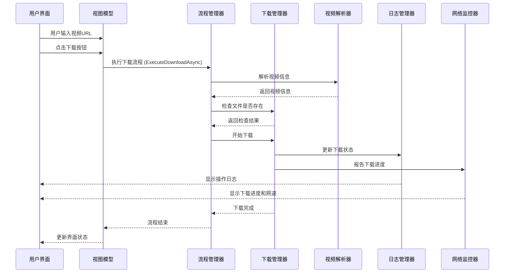

# 视频流研究器架构设计文档

## 1. 架构概述

视频流研究器采用现代化的 MVVM (Model-View-ViewModel) 架构模式，结合依赖注入和接口分离原则，实现了清晰的代码组织和良好的可维护性。项目基于 .NET 8.0 和 Avalonia UI 框架，支持跨平台运行。

### 1.1 架构层次

项目架构分为以下几个层次：

| 层次 | 职责 | 文件位置 | 核心组件 |
|------|------|----------|----------|
| **表示层 (UI)** | 用户界面展示和交互 | UI/ | MainWindow.axaml |
| **视图模型层 (ViewModels)** | 业务逻辑和数据绑定 | ViewModels/ | MainWindowViewModel.cs |
| **应用流程层 (App Flow)** | 业务流程编排 | Services/ | DownloadFlowManager.cs |
| **服务层 (Services)** | 核心功能实现 | Services/ | DownloadManager.cs, VideoParserWrapper.cs |
| **接口层 (Interfaces)** | 服务接口定义 | Interfaces/ | IServices.cs |
| **模型层 (Models)** | 数据模型定义 | Models/ | AppModels.cs |
| **日志层 (Logs)** | 日志管理和显示 | Logs/ | LogManager.cs, NetworkSpeedMonitor.cs |
| **基础设施层 (Infrastructure)** | 依赖注入等基础设施 | Infrastructure/ | DependencyInjectionConfig.cs |

### 1.2 核心流程图



## 2. 核心组件设计

### 2.1 依赖注入容器

依赖注入容器负责管理所有服务的生命周期和依赖关系，是整个应用的核心基础设施。

**实现文件**: `Infrastructure/DependencyInjectionConfig.cs`

**核心功能**:
- 注册所有服务接口和实现
- 配置服务生命周期
- 提供服务实例获取方法

**服务注册**:
| 服务接口 | 实现类 | 生命周期 |
|---------|--------|----------|
| IConfigManager | ConfigManager | 单例 |
| IDownloadFlowManager | DownloadFlowManager | 瞬态 |
| IDownloadManager | DownloadManager | 瞬态 |
| ILogManager | LogManager | 瞬态 |
| INetworkSpeedMonitor | NetworkSpeedMonitor | 瞬态 |
| IVideoParser | VideoParserWrapper | 瞬态 |
| MainWindowViewModel | MainWindowViewModel | 瞬态 |

### 2.2 下载管理器

下载管理器是项目的核心服务之一，负责处理视频下载的完整流程。

**实现文件**: `Services/DownloadManager.cs`

**核心功能**:
- 解析视频流信息
- 处理不同类型的下载模式（完整视频、仅音频、仅视频）
- 实现断点续传
- 合并音视频流
- 处理网络错误和异常

**下载流程**:
1. 检查文件是否已存在
2. 初始化下载参数
3. 下载视频流和音频流
4. 合并音视频流（如果需要）
5. 清理临时文件
6. 报告下载结果

### 2.3 视频解析器

视频解析器负责从视频URL中提取视频信息和流地址。

**实现文件**: `Services/VideoParserWrapper.cs`

**核心功能**:
- 包装 VideoStreamFetcher.Parsers.VideoParser
- 实现 IVideoParser 接口
- 处理解析错误和异常

### 2.4 日志管理器

日志管理器负责处理和显示操作日志，支持可折叠的日志结构。

**实现文件**: `Logs/LogManager.cs`

**核心功能**:
- 更新普通日志
- 更新可折叠日志
- 管理日志条目数量
- 支持日志的折叠/展开

### 2.5 网络速度监控器

网络速度监控器负责实时监控和显示下载速度和进度。

**实现文件**: `Logs/NetworkSpeedMonitor.cs`

**核心功能**:
- 实时显示下载速度
- 计算和显示预估剩余时间
- 绘制网速变化图表
- 提供进度动画效果

### 2.6 视图模型

视图模型是连接UI和服务的桥梁，实现了业务逻辑和数据绑定。

**实现文件**: `ViewModels/MainWindowViewModel.cs`

**核心功能**:
- 管理UI状态和属性
- 实现命令处理逻辑
- 协调服务调用
- 处理用户输入

**主要命令**:
- BrowseCommand: 浏览文件夹
- DownloadCommand: 开始下载
- CancelCommand: 取消下载
- ThemeToggleCommand: 切换主题
- EnterOptionModeCommand: 进入选项模式

## 3. 数据模型设计

### 3.1 核心数据模型

| 模型类 | 描述 | 字段 |
|-------|------|------|
| **AppConfig** | 应用程序配置 | SavePath, IsDarkTheme, IsFFmpegEnabled, MergeMode |
| **VideoInfo** | 视频信息 | Title, VideoStream, AudioStream, CombinedStreams |
| **VideoStreamInfo** | 视频流信息 | Url, Size, Quality |
| **LogEntry** | 日志条目 | Message, Timestamp, Level |

### 3.2 配置管理

应用程序配置使用 JSON 格式存储，通过 `ConfigManager` 服务进行管理。配置文件位于应用程序运行目录下的 `config.json` 文件中。

**配置选项**:
- **SavePath**: 默认保存路径
- **IsDarkTheme**: 是否使用深色主题
- **IsFFmpegEnabled**: 是否启用 FFmpeg（预留选项）
- **MergeMode**: MP4 合并模式

## 4. UI 设计与实现

### 4.1 主窗口布局

主窗口采用 Grid 布局，分为以下几个区域：

1. **视频URL输入区**：包含文本框和主题切换按钮
2. **保存路径区**：包含文本框和浏览按钮
3. **下载选项区**：包含单选按钮组和开始下载按钮
4. **状态和日志区**：包含网速显示、状态文本和可折叠日志

### 4.2 数据绑定

UI 元素通过 Avalonia 的数据绑定机制与 ViewModel 属性绑定：

- **视频URL**: `Text="{Binding Url, Mode=TwoWay}"`
- **保存路径**: `Text="{Binding SavePath, Mode=TwoWay}"`
- **下载选项**: `IsChecked="{Binding IsAudioOnly, Mode=TwoWay}"`
- **命令绑定**: `Command="{Binding DownloadCommand}"`

### 4.3 可折叠日志

可折叠日志使用自定义的 `CollapsibleLogItem` 控件实现，支持：

- 根日志条目的创建和管理
- 子日志条目的添加
- 日志的自动折叠/展开
- 不同类型日志的视觉区分

## 5. 错误处理与异常管理

### 5.1 异常处理策略

项目采用多层次的异常处理策略：

1. **服务层异常**: 在服务方法中捕获并处理特定异常，转换为友好的错误消息
2. **视图模型层异常**: 捕获服务层未处理的异常，更新UI状态和日志
3. **UI层异常**: 处理UI相关的异常，确保应用程序不会崩溃

### 5.2 错误消息处理

错误消息通过日志系统显示给用户，分为以下几种类型：

- **解析错误**: 视频解析失败时显示
- **下载错误**: 下载过程中出现错误时显示
- **网络错误**: 网络连接问题时显示
- **文件错误**: 文件操作失败时显示

## 6. 性能优化策略

### 6.1 内存管理

- **资源释放**: 使用 `using` 语句确保资源及时释放
- **对象复用**: 复用 UI 控件和数据结构，减少内存分配
- **垃圾回收**: 在适当的时候触发垃圾回收，特别是在处理大文件后

### 6.2 网络优化

- **断点续传**: 支持HTTP Range请求，实现断点续传
- **连接管理**: 优化HTTP连接管理，减少连接建立开销
- **超时设置**: 合理设置网络超时，避免无限等待

### 6.3 UI 响应性

- **异步操作**: 使用 `async/await` 模式执行耗时操作
- **Dispatcher**: 使用 `Dispatcher.UIThread` 确保UI更新在主线程执行
- **进度更新**: 优化进度更新频率，避免UI线程过载

## 7. 扩展与维护

### 7.1 支持新视频平台

要添加对新视频平台的支持，需要：

1. 实现 `IVideoParser` 接口的新实现
2. 在 `DependencyInjectionConfig.cs` 中注册新的解析器
3. 更新视频信息模型以支持新平台的特性

### 7.2 添加新功能

添加新功能的推荐流程：

1. 在 `Interfaces/IServices.cs` 中定义新服务接口
2. 在 `Services/` 目录中实现服务
3. 在 `DependencyInjectionConfig.cs` 中注册服务
4. 在 `ViewModels/MainWindowViewModel.cs` 中添加相应的属性和命令
5. 在 `UI/MainWindow.axaml` 中添加相应的UI元素

### 7.3 代码维护指南

- **命名规范**: 遵循 C# 命名规范，使用 PascalCase 命名类和方法
- **代码风格**: 使用一致的代码风格，包括缩进、空格和注释
- **文档**: 为公共方法和类添加 XML 文档注释
- **测试**: 为核心功能添加单元测试
- **日志**: 在关键操作处添加日志，便于调试和问题排查

## 8. 技术栈与依赖

| 技术/依赖 | 版本 | 用途 | 来源 |
|-----------|------|------|------|
| **.NET** | 8.0 | 运行时框架 | Microsoft |
| **Avalonia** | 11.0+ | 跨平台UI框架 | AvaloniaUI |
| **ReactiveUI** | 18.0+ | 响应式UI框架 | ReactiveUI |
| **Microsoft.Extensions.DependencyInjection** | 8.0+ | 依赖注入容器 | Microsoft |
| **Mp4Merger** | 自定义 | MP4音视频合并 | 项目引用 |
| **VideoStreamFetcher** | 自定义 | 视频流解析 | 项目引用 |
| **Fody** | 6.0+ | IL织入工具 | NuGet |
| **HtmlAgilityPack** | 1.11+ | HTML解析 | NuGet |
| **Newtonsoft.Json** | 13.0+ | JSON序列化 | NuGet |

## 9. 部署与发布

### 9.1 构建配置

项目支持以下构建配置：

- **Debug**: 调试配置，包含调试符号和详细日志
- **Release**: 发布配置，优化性能和大小

### 9.2 发布选项

| 发布选项 | 命令 | 说明 |
|----------|------|------|
| **框架依赖** | `dotnet publish -c Release` | 依赖目标机器安装.NET运行时 |
| **独立部署** | `dotnet publish -c Release -r win-x64 --self-contained true` | 包含所有依赖，无需.NET运行时 |
| **单文件部署** | `dotnet publish -c Release -r win-x64 --self-contained true /p:PublishSingleFile=true` | 打包为单个可执行文件 |
| **Trimmed部署** | `dotnet publish -c Release -r win-x64 --self-contained true /p:PublishTrimmed=true` | 裁剪未使用的代码，减小体积 |

### 9.3 跨平台支持

项目基于 Avalonia UI 框架，理论上支持以下平台：

- **Windows**: 完全支持
- **macOS**: 支持基础功能
- **Linux**: 支持基础功能
- **Android**: 部分支持，需要调整UI布局

## 10. 监控与日志

### 10.1 日志系统

项目使用自定义的日志系统，支持以下功能：

- **分级日志**: 不同类型的日志使用不同的图标标识
- **可折叠日志**: 支持日志的折叠和展开
- **实时更新**: 日志实时显示，无需刷新
- **自动清理**: 限制日志条目数量，避免内存占用过高

### 10.2 网络监控

网络监控系统提供以下功能：

- **实时网速**: 显示当前下载速度
- **进度动画**: 平滑的进度条动画
- **剩余时间**: 基于历史速度预估剩余下载时间
- **速度图表**: 显示网速变化趋势

## 11. 安全考虑

### 11.1 安全措施

- **网络请求安全**: 使用 HTTPS 协议，添加适当的请求头
- **文件操作安全**: 验证文件路径，避免路径遍历攻击
- **异常处理**: 避免在异常信息中泄露敏感信息
- **配置管理**: 不在配置文件中存储敏感信息

### 11.2 合规性

- **版权声明**: 明确声明工具的用途和限制
- **免责声明**: 声明工具仅用于技术研究和学习
- **使用限制**: 限制工具的商业用途

## 12. 结论与未来展望

### 12.1 架构优势

- **模块化设计**: 清晰的职责分离，便于维护和扩展
- **依赖注入**: 松耦合的组件设计，提高代码可测试性
- **响应式UI**: 使用 ReactiveUI 实现流畅的用户体验
- **跨平台支持**: 基于 Avalonia 框架，支持多平台运行
- **性能优化**: 多种性能优化策略，确保流畅的用户体验

### 12.2 未来改进方向

1. **多平台支持**: 进一步完善对 macOS 和 Linux 的支持
2. **移动平台适配**: 适配 Android 和 iOS 平台
3. **插件系统**: 实现插件系统，支持扩展视频平台
4. **批量下载**: 支持批量视频下载
5. **视频转码**: 集成视频转码功能
6. **云存储集成**: 支持将下载的视频上传到云存储
7. **多语言支持**: 添加多语言界面
8. **单元测试**: 完善单元测试覆盖率
9. **CI/CD**: 搭建持续集成和持续部署 pipeline
10. **文档完善**: 进一步完善项目文档

### 12.3 技术创新点

- **可折叠日志系统**: 提供清晰的操作记录和调试信息
- **智能网络监控**: 实时分析网络速度和预估下载时间
- **模块化架构**: 便于扩展和维护的代码结构
- **跨平台兼容**: 基于 Avalonia 实现的跨平台支持
- **响应式设计**: 使用 ReactiveUI 实现流畅的用户体验

## 13. 代码质量与架构评估

### 13.1 代码审查结果 (2026-04-18)

基于 MP4 Merger 架构师智能体的全面代码审查，以下是评估结果：

#### 总体评分

| 评估维度 | 评分 | 状态 |
|---------|------|------|
| **架构设计** | 85/100 | ✅ 良好 |
| **SOLID原则遵循** | 80/100 | ✅ 良好 |
| **编码标准** | 85/100 | ✅ 符合规范 |
| **代码可读性** | 88/100 | ✅ 优秀 |
| **可维护性** | 82/100 | ✅ 良好 |
| **性能考虑** | 80/100 | ✅ 良好 |
| **安全考虑** | 75/100 | ⚠️ 需改进 |

#### SOLID原则遵循情况

| 原则 | 状态 | 说明 |
|------|------|------|
| **单一职责 (SRP)** | ✅ 遵循 | MP4Merger/MediaProcessor 职责清晰，VideoDownloader 需拆分 |
| **开闭原则 (OCP)** | ✅ 遵循 | 工厂模式和策略模式应用得当，易于扩展新平台解析器 |
| **里氏替换 (LSP)** | ✅ 遵循 | BoxBase 抽象基类设计合理 |
| **接口隔离 (ISP)** | ✅ 遵循 | IPlatformParser 接口精简专注 |
| **依赖倒置 (DIP)** | ✅ 遵循 | 高层模块依赖抽象接口 |

#### 设计模式应用

1. **工厂模式** - VideoParserFactory
   - 根据 URL 自动分发到对应解析器
   - 支持动态扩展新平台

2. **策略模式** - IPlatformParser
   - 统一接口定义平台解析行为
   - BilibiliParser、MiyousheParser、KuaishouParserLite 等实现

3. **依赖注入** - VideoStreamClient
   - 支持构造函数注入
   - 提高可测试性

#### 关键改进建议

**高优先级：**
1. **拆分 VideoDownloader 类** (550+行)
   - 拆分为 StreamPathResolver、RemuxService、DownloadStrategyFactory
   - 减少单个类的职责

2. **加强输入验证**
   - 添加文件路径安全性验证
   - 防止路径遍历攻击

**中优先级：**
3. **统一异常处理策略**
   - 定义领域特定异常
   - 保留异常堆栈信息

4. **提取硬编码配置**
   - User-Agent、超时时间等
   - 使用配置类管理

**低优先级：**
5. 启用可空引用类型
6. 完善异步方法命名规范

### 13.2 项目结构优化

```
src/
├── Mp4Merger.Core/          # MP4合并核心库
│   ├── Boxes/               # MP4盒子定义 (BoxBase, FtypBox, MdatBox, MoovBox)
│   ├── Builders/            # 轨道构建器 (AudioTrackBuilder, VideoTrackBuilder)
│   ├── Core/                # 核心处理类
│   │   ├── MP4Merger.cs     # 合并协调器
│   │   ├── MediaProcessor.cs # 媒体数据处理
│   │   ├── MP4Writer.cs     # 文件写入
│   │   └── MP4Validator.cs  # 验证器
│   ├── Media/               # 媒体提取
│   ├── Models/              # 数据模型 (MP4FileInfo, MergeResult)
│   ├── Services/            # 公共服务 (Mp4MergeService)
│   └── Utils/               # 工具类
├── VideoStreamFetcher/      # 视频流获取库
│   ├── Auth/                # 认证管理 (BilibiliLoginManager)
│   ├── Downloads/           # 下载功能
│   │   ├── VideoDownloader.cs    # 主下载器 (需重构)
│   │   ├── HlsDownloader.cs      # HLS下载器
│   │   ├── VideoDownloadOptions.cs # 下载选项
│   │   └── DownloadPathHelper.cs   # 路径辅助
│   ├── Parsers/             # 视频解析
│   │   ├── PlatformParsers/ # 平台特定解析器
│   │   │   ├── IPlatformParser.cs      # 解析器接口
│   │   │   ├── VideoParserFactory.cs   # 解析器工厂
│   │   │   ├── BilibiliParser.cs       # B站解析器
│   │   │   ├── MiyousheParser.cs       # 米游社解析器
│   │   │   └── KuaishouParserLite.cs   # 快手解析器
│   │   ├── VideoParser.cs   # 主解析器
│   │   ├── VideoInfo.cs     # 视频信息模型
│   │   └── HttpHelper.cs    # HTTP请求辅助
│   └── Remux/               # 转封装功能 (TsToMp4Remuxer)
├── VideoPreviewer/          # 视频预览
└── NativeVideoProcessor/    # 原生视频处理
```

## 附录 A: 核心 API 参考

### A.1 IDownloadManager 接口

```csharp
public interface IDownloadManager : IDisposable
{
    Task<long> DownloadVideo(
        object videoInfo,
        string savePath,
        Action<double> progressCallback,
        Action<string> statusCallback,
        Action<long> speedCallback,
        bool audioOnly = false,
        bool videoOnly = false,
        bool noMerge = false,
        bool isFFmpegEnabled = false,
        int mergeMode = 1);
        
    bool CheckFileExists(
        object videoInfo,
        string savePath,
        Action<string> statusCallback,
        bool audioOnly = false,
        bool videoOnly = false);
        
    void CancelDownload();
}
```

### A.2 IVideoParser 接口

```csharp
public interface IVideoParser : IDisposable
{
    Task<object?> ParseVideoInfo(string url, Action<string> statusCallback);
}
```

### A.3 ILogManager 接口

```csharp
public interface ILogManager
{
    void UpdateLog(string message);
    void UpdateCollapsibleLog(string message, bool isRootItem = true, bool autoCollapse = true);
    void ResetCollapsibleLog();
}
```

### A.4 INetworkSpeedMonitor 接口

```csharp
public interface INetworkSpeedMonitor : IDisposable
{
    void UpdateProcessingProgress(double progress);
    void UpdateCurrentStatus(string status);
    void OnSpeedUpdate(long speed, bool isInitial = false);
    void MarkDownloadCompleted();
    void MarkDownloadCanceled();
    Task ResetProgressAnimation();
}
```

### A.5 IConfigManager 接口

```csharp
public interface IConfigManager
{
    T ReadConfig<T>(string key, T defaultValue = default);
    void SaveConfig<T>(string key, T value);
    void ResetConfig();
}
```

## 附录 B: 配置文件参考

### B.1 config.json 示例

```json
{
  "SavePath": "C:\\Users\\Username\\Desktop",
  "IsDarkTheme": true,
  "IsFFmpegEnabled": false,
  "MergeMode": 1
}
```

### B.2 配置选项说明

| 配置项 | 类型 | 默认值 | 说明 |
|--------|------|--------|------|
| **SavePath** | string | Desktop | 默认保存路径 |
| **IsDarkTheme** | bool | true | 是否使用深色主题 |
| **IsFFmpegEnabled** | bool | false | 是否启用FFmpeg（预留） |
| **MergeMode** | int | 1 | MP4合并模式（1=NonFragmented） |

## 附录 C: 常见问题与解决方案

| 问题 | 可能原因 | 解决方案 |
|------|----------|----------|
| **视频解析失败** | URL格式错误或网络问题 | 检查URL格式，确保网络连接正常 |
| **下载速度慢** | 网络限制或服务器限速 | 尝试使用不同网络，或稍后再试 |
| **合并失败** | 磁盘空间不足或权限问题 | 确保磁盘空间充足，检查文件权限 |
| **应用程序崩溃** | 未处理的异常 | 查看日志文件，联系开发者 |
| **配置保存失败** | 权限问题 | 确保应用程序有写入权限 |
| **主题切换无效** | 配置未保存 | 重启应用程序，检查配置文件权限 |
```